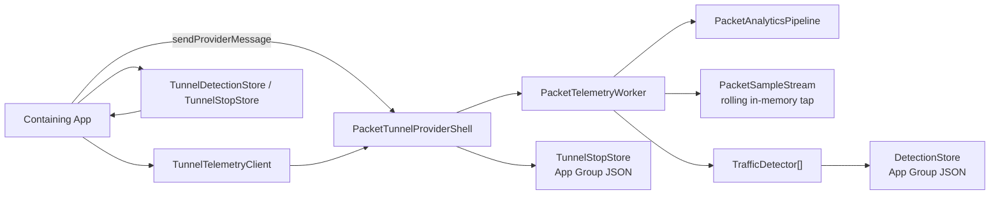

<!--
Created by Will Kusch, Relative Companies, Inc.
Copyright (c) 2026 Relative Companies, Inc.
Licensed for personal, non-commercial use only. See LICENSE for terms.
-->

# Architecture

`relative-protocol` is built around a single rule: the tunnel extension owns runtime detection.

The containing app can read current and persisted state, but it should not be the brain of the detector system.

## Runtime Model

There are two telemetry surfaces:

1. `live tap`
   - rolling in-memory packet/event window
   - roughly `10s` by default
   - foreground app reads it on demand
   - intentionally leaner than the full detector-facing sparse stream

2. `durable detections`
   - compact detector outputs persisted in the App Group container
   - survive app suspension, process death, and long background gaps

## Architecture Diagram



## Package Layout

- `Sources/Analytics`
  - packet summarization, rolling tap, detector protocol, detector store, app-message payloads
- `Sources/TunnelControl`
  - `NEPacketTunnelProvider` shell, profile decoding, tunnel/app messaging, startup/shutdown wiring
- `Sources/PacketRelay`
  - SOCKS5 TCP/UDP relay, tunnel bridge, packet forwarding
- `Sources/TunnelRuntime`
  - dataplane runtime orchestration and deterministic test helpers
- `Sources/DataplaneFFI`
  - Swift/C bridge into the bundled dataplane runtime
- `Sources/HostClient`
  - host-app snapshot client and persisted store readers
- `Sources/Observability`
  - structured logging, JSONL/OSLog sinks, signposts
- `Sources/HarnessLocal`
  - local harness for replay and package-level testing

## Core Concepts

### Rolling Live Tap

`PacketSampleStream` is an in-memory rolling window.
It is intentionally ephemeral and exists so a foreground app can inspect recent evidence without forcing the tunnel to keep a durable packet log.

The default app-facing live tap surfaces:

- `flowOpen`
- `metadata`
- `burst`
- `flowClose`

It keeps high-volume detector records, such as `flowSlice` and `packetCue`, out of foreground snapshots unless explicitly supported.

### Detector Pipeline

`PacketAnalyticsPipeline` turns raw packets into sparse detector-friendly events:

- `flowOpen`
- `flowSlice`
- `flowClose`
- `metadata`
- `burst`
- `activitySample`
- `packetCue`
- `sourceAppFlow`

These are not full packet logs. They are lower-cost runtime signals designed for detectors.

### Durable Detections

`DetectionStore` persists compact summaries such as:

- detector identifier
- signal kind
- target bucket
- timestamp
- confidence
- aggregate counts
- recent redacted detector events

This is the durable system of record for background correctness.

## App Group Layout

The package writes small, explicit artifacts under the App Group container:

```text
<AppGroup>/Analytics/
  Detections/
    detections.json
  last-stop.json
<AppGroup>/Logs/
  events.current.jsonl
  events.<timestamp>.<sequence>.jsonl
  events.example.current.jsonl
  events.example.<timestamp>.<sequence>.jsonl
```

Persisted App Group artifacts are file-protected and excluded from device/iCloud backup.

The package does not persist the rolling live tap. It does persist bounded JSONL tunnel logs by default. If a containing app also writes JSONL diagnostics into the same App Group, give that app its own `JSONLLogSink` file prefix so both processes never append to one active file.

## Background Correctness Rules

A foreground app cannot be the source of truth for traffic detection.

Recommended split:

- extension
  - live packet/event tap
  - detector execution
  - durable detector persistence
- app
  - foreground snapshot reads
  - persisted detector/stop recovery on resume
  - UI and product logic built on detector outputs

## Data Minimization

The package is intentionally shaped to minimize data retention:

- rolling live tap is memory-only
- detector outputs are compact and explicit
- persisted detector snapshots are privacy-redacted, file-protected, and excluded from backup
- no continuous raw packet log is written by default

If you add custom detectors, keep that same discipline. Only persist what the product truly needs.
