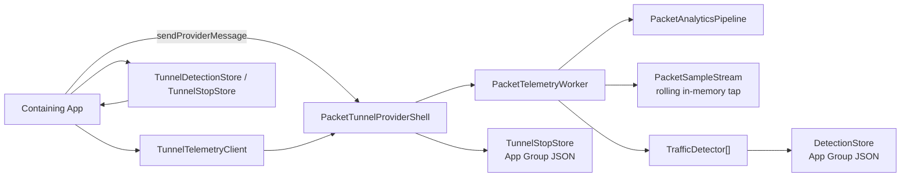

# VPNBridgeTunnel

`VPNBridgeTunnel` is a Swift package for packet-tunnel VPN products that need three things at once:

1. a real packet tunnel dataplane
2. a bounded, app-readable live telemetry tap
3. durable, pluggable traffic detectors that run inside the tunnel extension

The package is detector-first, not packet-log-first.
It is designed so the tunnel can stay alive and keep detecting while the containing app is suspended, while the app can still read a recent live window on demand when it is foregrounded.

## What This Package Does

- runs a packet tunnel using `NEPacketTunnelProvider`
- bridges packets into a local SOCKS relay + dataplane
- emits a bounded in-memory rolling telemetry window
- runs one or more detectors inside the tunnel extension
- persists compact detector outputs and stop breadcrumbs to the App Group container
- exposes foreground snapshots through `NETunnelProviderSession.sendProviderMessage`

## What This Package Does Not Do

- continuously persist raw packet history to disk
- assume the containing app can stay awake forever in the background
- force one product-specific detector vocabulary on all package users

## Current Runtime Model

There are two telemetry surfaces:

1. `live tap`
   - rolling in-memory packet/event window
   - roughly `10s` by default
   - foreground app reads it on demand

2. `durable detections`
   - compact detector outputs persisted in the App Group container
   - survive app suspension, process death, and long background gaps

The tunnel extension is the source of truth for detection.
The containing app is a reader, not the runtime brain.

## Package Layout

- `Sources/Analytics`
  - packet summarization, rolling tap, detector protocol, detector store, app-message payloads
- `Sources/TunnelControl`
  - `NEPacketTunnelProvider` shell, profile decoding, tunnel/app messaging, startup/shutdown wiring
- `Sources/PacketRelay`
  - SOCKS5 TCP/UDP relay, tunnel bridge, packet forwarding
- `Sources/TunnelRuntime`
  - dataplane runtime orchestration and deterministic test helpers
- `Sources/DataplaneFFI`
  - Swift/C bridge into the bundled dataplane runtime
- `Sources/HostClient`
  - host-app snapshot client and persisted store readers
- `Sources/Observability`
  - structured logging, JSONL/OSLog sinks, signposts
- `Sources/HarnessLocal`
  - local harness for replay and package-level testing

## Public Integration Surface

Most host apps interact with these types:

- `TunnelProfile`
- `TunnelProfileManager`
- `PacketTunnelProviderShell`
- `TunnelTelemetryClient`
- `TunnelDetectionStore`
- `TunnelStopStore`
- `TrafficDetector`
- `DetectionEvent`
- `DetectionSnapshot`

## Architecture



## Core Concepts

### Rolling Live Tap

`PacketSampleStream` is an in-memory ring-like rolling window.
It is intentionally ephemeral.
It exists so a foreground app can inspect recent evidence without forcing the tunnel to keep a durable packet log.

### Detector Pipeline

`PacketAnalyticsPipeline` turns raw packets into sparse detector-friendly events:

- `flowOpen`
- `metadata`
- `burst`
- `activitySample`

These are not full packet logs.
They are lower-cost runtime signals designed for detectors.

### Durable Detections

`DetectionStore` persists compact summaries such as:

- detector identifier
- signal kind
- target bucket
- timestamp
- confidence
- aggregate counts
- recent redacted detector events

This is the durable system of record for background correctness.

## App Group Layout

The package writes small, explicit artifacts under the App Group container:

```text
<AppGroup>/Analytics/
  Detections/
    detections.json
  last-stop.json
<AppGroup>/Logs/
  events.current.jsonl
  events.<timestamp>.<sequence>.jsonl
```

Persisted App Group artifacts are file-protected and excluded from device/iCloud backup.

The package does not persist the rolling live tap.
It does persist bounded JSONL tunnel logs by default.

## Installation

Add the package to your app and tunnel extension targets through Swift Package Manager.

### Package products

- `Analytics`
- `DataplaneFFI`
- `HostClient`
- `Observability`
- `PacketRelay`
- `TunnelControl`
- `TunnelRuntime`

### Typical target wiring

Most apps should link products like this:

- containing app target
  - `HostClient`
  - `TunnelControl`
- packet tunnel extension target
  - `Analytics`
  - `TunnelControl`
  - `PacketRelay`
  - `TunnelRuntime`
  - `Observability`
  - `DataplaneFFI`

The app mainly:

- installs and updates the VPN profile
- starts and stops the tunnel
- reads foreground snapshots
- reads persisted detections and stop records

The extension mainly:

- runs the tunnel
- runs detectors
- persists durable detector outputs
- exposes the live tap through provider messages

## Tunnel Integration

### 1. Define a tunnel provider subclass

Subclass `PacketTunnelProviderShell` inside your Network Extension target.

```swift
import TunnelControl

final class PacketTunnelProvider: PacketTunnelProviderShell {}
```

That is enough for the default runtime.

If you want custom detectors, override `makeDetectors(...)` in this subclass.

### 2. Build and persist a `TunnelProfile`

The containing app supplies provider configuration through `NETunnelProviderProtocol.providerConfiguration`.

Important fields in `TunnelProfile`:

- `appGroupID`
- `tunnelRemoteAddress`
- `mtu`
- `ipv6Enabled`
- `dnsServers`
- `engineSocksPort`
- `engineLogLevel`
- `telemetryEnabled`
- `liveTapEnabled`
- `liveTapMaxBytes`
- `signatureFileName`
- `relayEndpoint`
- `dataplaneConfigJSON`

`telemetryEnabled = true` enables:

- the sparse packet analytics pipeline
- in-extension detectors
- durable detection persistence

`liveTapEnabled = true` enables:

- the rolling live tap
- foreground packet/event snapshots

`liveTapEnabled` only has effect when `telemetryEnabled` is also `true`.

### 3. Configure `NETunnelProviderManager` in the containing app

The package does not install the VPN profile for you automatically.
Your app still owns:

- creating a `NETunnelProviderManager`
- assigning a `NETunnelProviderProtocol`
- writing `TunnelProfile` into `providerConfiguration`
- saving/loading preferences
- starting and stopping the connection

`TunnelProfileManager.configure(...)` exists to keep that profile encoding consistent.

### 4. Start the tunnel normally

Use `NETunnelProviderManager` / `NEVPNManager` from the containing app.
`PacketTunnelProviderShell` handles:

- network settings install
- SOCKS relay startup
- dataplane startup
- packet read/write loops
- app-message handling

## Foreground App Reads

Use `TunnelTelemetryClient` while the app is active.

```swift
import HostClient
import NetworkExtension

let client = TunnelTelemetryClient()
let snapshot = try await client.snapshot(from: manager.connection, packetLimit: 48)

print(snapshot.samples.count)
print(snapshot.detections.totalDetectionCount)
```

Available operations:

- `snapshot(from:packetLimit:)`
- `clearRecentEvents(from:)`
- `clearDetections(from:)`

This uses Apple’s tunnel-provider messaging path rather than a shared file tail.

## Background Recovery

When the app is resumed after a long background period, read persisted detector outputs instead of depending on the live tap.

```swift
import HostClient

let store = TunnelDetectionStore(appGroupID: "group.com.example.vpn")
let detections = try store.load() ?? .empty
let lastStop = try TunnelStopStore(appGroupID: "group.com.example.vpn").load()
```

Use the live tap for recent context.
Use the persisted store for durable correctness.

## Adding Custom Detectors

The package exposes `TrafficDetector` so downstream users can add their own runtime logic.

```swift
import Analytics

final class AdBurstDetector: TrafficDetector {
    let identifier = "ad-burst"

    func ingest(_ records: DetectorRecordCollection) -> [DetectionEvent] {
        // Inspect sparse records and emit durable detections when your conditions match.
        return []
    }

    func reset() {}
}
```

### Detector implementation options

`TrafficDetector` is intentionally generic.
The package does not force one detector style.

Common patterns:

1. heuristic detector
   - plain Swift logic over `DetectorRecord`
   - best default choice
   - easiest to test and reason about

2. rules-engine detector
   - same as a heuristic detector, but with externally supplied thresholds or signatures
   - useful when non-code tuning matters

3. tiny ML detector
   - small in-process model fed by sparse feature vectors
   - good for scoring sequences or confidence
   - should run on detector features, not raw packets

4. native scorer detector
   - Swift detector calls into C, C++, Rust, or another embedded native library
   - useful when you already have an optimized scoring engine

The package contract is the same in all four cases:

- ingest sparse `DetectorRecord` batches
- keep bounded in-memory state
- emit `DetectionEvent`
- persist only compact outputs

### What belongs inside a detector

Good detector responsibilities:

- feature extraction from sparse records
- short rolling state keyed by flow, host, or target bucket
- sequence scoring
- confidence assignment
- emitting compact `DetectionEvent` values

Bad detector responsibilities:

- raw packet capture
- blocking file I/O
- network requests
- cross-process RPC
- unbounded caches
- large per-packet model inference

### Using a tiny ML model

If you want ML-backed detection, the recommended shape is:

1. use `PacketAnalyticsPipeline` output as features, not raw packets
2. build a compact feature vector inside your detector
3. load the model once
4. score synchronously and cheaply
5. emit a normal `DetectionEvent`

This usually means:

- `CoreML` model loaded in the tunnel extension target
- or a tiny custom scorer linked into the extension

Keep the bar high:

- small model
- low latency
- no dynamic downloads
- no per-record heavy allocation

### Using a native binary or embedded scorer

If you already have a small native detector/scorer:

- link it into the tunnel extension target
- wrap it behind a Swift `TrafficDetector`
- pass only compact features across the boundary

Do not design this as an external process.
The detector must run in-process inside the extension.

### Detector design checklist

Before shipping a custom detector, make sure it:

1. processes `DetectorRecordCollection` in linear time
2. keeps bounded memory
3. does not block the telemetry worker
4. degrades gracefully when some records are skipped or shed
5. uses stable `signal`, `target`, and `trigger` strings
6. persists only the detector output, not raw evidence
7. can recover correctly after long app background gaps

### Register detectors

Override `PacketTunnelProviderShell.makeDetectors(profile:analyticsRootURL:logger:)` in your provider subclass.

```swift
import Analytics
import Observability
import TunnelControl

final class PacketTunnelProvider: PacketTunnelProviderShell {
    override func makeDetectors(
        profile: TunnelProfile,
        analyticsRootURL: URL,
        logger: StructuredLogger
    ) async throws -> [any TrafficDetector] {
        _ = profile
        _ = analyticsRootURL
        _ = logger

        return [
            AdBurstDetector()
        ]
    }
}
```

This is the main extension point for detector customization.

### Integrating detectors in a different app

For a host app, the typical setup is:

1. add the package to both your app target and packet tunnel extension target
2. create your own `PacketTunnelProvider: PacketTunnelProviderShell`
3. override `makeDetectors(...)`
4. return your custom detector list
5. use `TunnelTelemetryClient` in the app for foreground snapshots
6. use `TunnelDetectionStore` and `TunnelStopStore` for background recovery

That is the supported package integration path.
You do not need to patch package internals to add detectors.

## Detector Contract

`TrafficDetector` implementations receive `DetectorRecord` batches.
Those records contain stable fields such as:

- `kind`
- `timestamp`
- `direction`
- `bytes`
- `packetCount`
- `flowPacketCount`
- `flowByteCount`
- `protocolHint`
- `sourcePort`
- `destinationPort`
- `flowHash`
- `registrableDomain`
- `dnsQueryName`
- `dnsCname`
- `dnsAnswerAddresses`
- `ipVersion`
- `transportProtocolNumber`
- `tlsServerName`
- `quicVersion`
- `quicPacketType`
- `quicDestinationConnectionId`
- `quicSourceConnectionId`
- `classification`
- `burstDurationMs`
- `burstPacketCount`

`DetectorRecordCollection` is a lightweight batch wrapper.
Use it when you want to:

- iterate the batch once
- short-circuit on the first strong match
- avoid materializing extra arrays inside your detector

Hot-path rule:

- `ingest(_:)` runs inline on the single telemetry worker
- do not do blocking I/O
- do not sleep or wait on cross-process work
- do not allocate unbounded state from packet input
- keep per-batch work linear and cheap

Detectors emit `DetectionEvent` values.
Those are what the package persists and surfaces to the app.

String-field contract:

- `detectorIdentifier` is the primary namespace
- `signal` is a stable detector-defined event identifier
- `target` is an optional stable detector-defined subject bucket
- `trigger` is a stable detector-defined cause label
- downstream code should treat unknown values as forward-compatible and scope parsing by `detectorIdentifier`

Recommended naming pattern:

- `detectorIdentifier`
  - stable namespace for one detector implementation
  - example: `ad-burst`
- `signal`
  - stable event kind within that detector
  - example: `video-transition`
- `target`
  - stable subject bucket if you need one
  - example: `pre-roll-ad`
- `trigger`
  - stable cause or evidence label
  - example: `burst`

That gives downstream code a forward-compatible parsing model.

## Detector Persistence Model

`DetectionSnapshot` is the durable aggregate returned to the app.
It includes:

- `updatedAt`
- `totalDetectionCount`
- `countsByDetector`
- `countsByTarget`
- `recentEvents`

This is intentionally generic.
If you need richer detector-specific state, you can either:

- expose it in live foreground reads through `DetectionEvent.metadata`
- or maintain your own auxiliary store in the App Group container for durable state

Recommended persistence split:

- live tap
  - short-lived evidence/debug context
- `DetectionSnapshot`
  - durable product state
- your own auxiliary detector store
  - only if your product truly needs detector-specific durable state

## Signatures

`SignatureClassifier` can optionally load a signature file from:

```text
<AppGroup>/Analytics/AppSignatures/<signatureFileName>
```

Current JSON shape:

```json
{
  "version": 1,
  "updatedAt": "2026-03-04T00:00:00Z",
  "signatures": [
    {
      "label": "social-video",
      "domains": ["video-cdn.example", "media-edge.example"]
    }
  ]
}
```

The analytics pipeline uses signatures as low-cost classification input.

## Operational Defaults

Current package defaults:

- live tap retention window: `10s`
- foreground packet snapshot cap: `96`
- telemetry queue cap: `2` batches / `256 KB`
- health sample interval: `60s`
- more aggressive telemetry backoff at elevated thermal states

These defaults bias toward tunnel stability and battery efficiency over exhaustive logging.

## Thermal Model

The worker reads:

- `ProcessInfo.thermalState`
- `ProcessInfo.isLowPowerModeEnabled`

Policy shape:

- `nominal`
  - sparse activity samples enabled
  - limited deep metadata allowed
- `fair`
  - deep metadata off
  - activity samples off
  - burst-only sparse persistence remains
- `serious` / `critical` / low power mode
  - same or harsher reduced mode

This is intentional.
The package is designed to degrade telemetry cost before the tunnel becomes thermally unsafe.

## Debugging

### Structured logs

The package logs through `StructuredLogger` and the `Observability` module.
By default, high-value lifecycle and fault events are retained while hot-path noise stays reduced.

Important files:

- `Sources/Observability/StructuredLogger.swift`
- `Sources/Observability/JSONLLogSink.swift`
- `Sources/Observability/OSLogSink.swift`
- `Sources/Observability/LogEnvelope.swift`

### Last stop reason

The provider persists a small stop breadcrumb to:

```text
<AppGroup>/Analytics/last-stop.json
```

Read it through `TunnelStopStore` when debugging unexpected exits.

### Detector debugging

For detector debugging, inspect both:

1. live tap snapshots from `TunnelTelemetryClient`
2. persisted detection summaries from `TunnelDetectionStore`

That split matters:

- live tap explains the last few seconds
- persisted detections explain long background spans

Useful detector debugging questions:

1. did the tunnel see the expected sparse records?
2. did the detector emit at the right boundary?
3. did confidence match the evidence strength?
4. did the detection persist across app suspension?
5. did shed mode materially affect the detector?

If you are debugging model-backed detectors, also record:

- model load success
- model version
- feature-vector shape
- scoring latency bucket

## Profiling Guidance

Use Instruments in separate passes.
Do not stack heavy templates for long runs unless you are chasing a very specific issue.

Recommended order:

1. `Energy Log`
2. `VM Tracker`
3. `Time Profiler` only if a thermal or CPU issue remains

### Why

- `Energy Log` is the cleanest battery/thermal truth
- `VM Tracker` is the cleanest memory truth
- `Time Profiler` is best for root-causing hotspots after one of the above shows a problem

## Stability Checklist

Before calling a build production-ready, validate:

1. `30–60 min` soak with no unexpected tunnel exits
2. Wi‑Fi / `5G` / `LTE` / degraded-network switching
3. background correctness with the containing app suspended
4. persisted detector outputs remain correct after resume
5. no steady memory climb in `VM Tracker`
6. normal usage stays `Nominal` in `Energy Log`

## Background Correctness Rules

A foreground app cannot be the source of truth for traffic detection.
The extension must own runtime detection.

The recommended split is:

- extension
  - live packet/event tap
  - detector execution
  - durable detector persistence
- app
  - foreground snapshot reads
  - persisted detector/stop recovery on resume
  - UI and product logic built on detector outputs

## Production Rollout Guidance

For rollout, track at minimum:

- tunnel start success rate
- unexpected stop rate
- last-stop reason distribution
- detection persistence correctness on resume
- network transition recovery
- thermal state during real usage
- telemetry accepted / skipped / shed rates

Do not use raw packet persistence as your operational metric source.
Use detector outputs and lifecycle signals.

## Security And Data Minimization

The package is intentionally shaped to minimize data retention:

- rolling live tap is memory-only
- detector outputs are compact and explicit
- persisted detector snapshots are privacy-redacted, file-protected, and excluded from backup
- no continuous raw packet log is written by default

If you add custom detectors, keep that same discipline.
Only persist what the product truly needs.

## Apple API References

The package relies on these Apple APIs and behaviors:

- [NEPacketTunnelProvider](https://developer.apple.com/documentation/networkextension/nepackettunnelprovider)
- [NETunnelProvider](https://developer.apple.com/documentation/networkextension/netunnelprovider)
- [NETunnelProviderSession.sendProviderMessage(_:responseHandler:)](https://developer.apple.com/documentation/networkextension/netunnelprovidersession/sendprovidermessage(_:responsehandler:))
- [NETunnelProvider.handleAppMessage(_:completionHandler:)](https://developer.apple.com/documentation/networkextension/netunnelprovider/handleappmessage(_:completionhandler:))
- [FileManager.containerURL(forSecurityApplicationGroupIdentifier:)](https://developer.apple.com/documentation/foundation/filemanager/containerurl(forsecurityapplicationgroupidentifier:))
- [ProcessInfo.thermalState](https://developer.apple.com/documentation/foundation/processinfo/thermalstate)
- [ProcessInfo.isLowPowerModeEnabled](https://developer.apple.com/documentation/foundation/processinfo/islowpowermodeenabled)
- [Data.write(to:options:)](https://developer.apple.com/documentation/foundation/data/write(to:options:))

## License / Usage Notes

This package is infrastructure.
Its compliance story depends on how you use it.
If your product infers cross-app behavior, your privacy disclosures and App Review notes need to describe that clearly and accurately.
