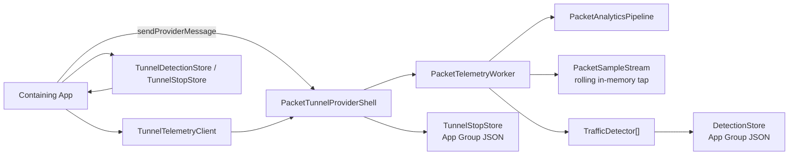

# VPNBridgeTunnel

`VPNBridgeTunnel` is a Swift package for packet-tunnel VPN products that need three things at once:

1. a real packet tunnel dataplane
2. a bounded, app-readable live telemetry tap
3. durable, pluggable traffic detectors that run inside the tunnel extension

The package is detector-first, not packet-log-first.
It is designed so the tunnel can stay alive and keep detecting while the containing app is suspended, while the app can still read a recent live window on demand when it is foregrounded.

## What This Package Does

- runs a packet tunnel using `NEPacketTunnelProvider`
- bridges packets into a local SOCKS relay + dataplane
- emits a bounded in-memory rolling telemetry window
- runs one or more detectors inside the tunnel extension
- persists compact detector outputs and stop breadcrumbs to the App Group container
- exposes foreground snapshots through `NETunnelProviderSession.sendProviderMessage`

## What This Package Does Not Do

- continuously persist raw packet history to disk
- assume the containing app can stay awake forever in the background
- force one product-specific detector vocabulary on all package users

## Current Runtime Model

There are two telemetry surfaces:

1. `live tap`
   - rolling in-memory packet/event window
   - roughly `10s` by default
   - foreground app reads it on demand

2. `durable detections`
   - compact detector outputs persisted in the App Group container
   - survive app suspension, process death, and long background gaps

The tunnel extension is the source of truth for detection.
The containing app is a reader, not the runtime brain.

## Package Layout

- `Sources/Analytics`
  - packet summarization, rolling tap, detector protocol, detector store, app-message payloads
- `Sources/TunnelControl`
  - `NEPacketTunnelProvider` shell, profile decoding, tunnel/app messaging, startup/shutdown wiring
- `Sources/PacketRelay`
  - SOCKS5 TCP/UDP relay, tunnel bridge, packet forwarding
- `Sources/TunnelRuntime`
  - dataplane runtime orchestration and deterministic test helpers
- `Sources/DataplaneFFI`
  - Swift/C bridge into the bundled dataplane runtime
- `Sources/HostClient`
  - host-app snapshot client and persisted store readers
- `Sources/Observability`
  - structured logging, JSONL/OSLog sinks, signposts
- `Sources/HarnessLocal`
  - local harness for replay and package-level testing

## Public Integration Surface

Most host apps interact with these types:

- `TunnelProfile`
- `TunnelProfileManager`
- `PacketTunnelProviderShell`
- `TunnelTelemetryClient`
- `TunnelDetectionStore`
- `TunnelStopStore`
- `TrafficDetector`
- `DetectionEvent`
- `DetectionSnapshot`

## Architecture



## Core Concepts

### Rolling Live Tap

`PacketSampleStream` is an in-memory ring-like rolling window.
It is intentionally ephemeral.
It exists so a foreground app can inspect recent evidence without forcing the tunnel to keep a durable packet log.

### Detector Pipeline

`PacketAnalyticsPipeline` turns raw packets into sparse detector-friendly events:

- `flowOpen`
- `metadata`
- `burst`
- `activitySample`

These are not full packet logs.
They are lower-cost runtime signals designed for detectors.

### Durable Detections

`DetectionStore` persists compact summaries such as:

- detector identifier
- signal kind
- target bucket
- timestamp
- confidence
- aggregate counts
- recent redacted detector events

This is the durable system of record for background correctness.

## App Group Layout

The package writes small, explicit artifacts under the App Group container:

```text
<AppGroup>/Analytics/
  Detections/
    detections.json
  last-stop.json
<AppGroup>/Logs/
  events.current.jsonl
  events.<timestamp>.<sequence>.jsonl
```

Persisted App Group artifacts are file-protected and excluded from device/iCloud backup.

The package does not persist the rolling live tap.
It does persist bounded JSONL tunnel logs by default.

## Installation

Add the package to your app and tunnel extension targets through Swift Package Manager.

### Package products

- `Analytics`
- `DataplaneFFI`
- `HostClient`
- `Observability`
- `PacketRelay`
- `TunnelControl`
- `TunnelRuntime`

## Tunnel Integration

### 1. Define a tunnel provider subclass

Subclass `PacketTunnelProviderShell` inside your Network Extension target.

```swift
import TunnelControl

final class PacketTunnelProvider: PacketTunnelProviderShell {}
```

That is enough for the default runtime.

### 2. Build and persist a `TunnelProfile`

The containing app supplies provider configuration through `NETunnelProviderProtocol.providerConfiguration`.

Important fields in `TunnelProfile`:

- `appGroupID`
- `tunnelRemoteAddress`
- `mtu`
- `ipv6Enabled`
- `dnsServers`
- `engineSocksPort`
- `engineLogLevel`
- `telemetryEnabled`
- `liveTapEnabled`
- `liveTapMaxBytes`
- `signatureFileName`
- `relayEndpoint`
- `dataplaneConfigJSON`

`telemetryEnabled = true` enables:

- the sparse packet analytics pipeline
- in-extension detectors
- durable detection persistence

`liveTapEnabled = true` enables:

- the rolling live tap
- foreground packet/event snapshots

`liveTapEnabled` only has effect when `telemetryEnabled` is also `true`.

### 3. Start the tunnel normally

Use `NETunnelProviderManager` / `NEVPNManager` from the containing app.
`PacketTunnelProviderShell` handles:

- network settings install
- SOCKS relay startup
- dataplane startup
- packet read/write loops
- app-message handling

## Foreground App Reads

Use `TunnelTelemetryClient` while the app is active.

```swift
import HostClient
import NetworkExtension

let client = TunnelTelemetryClient()
let snapshot = try await client.snapshot(from: manager.connection, packetLimit: 48)

print(snapshot.samples.count)
print(snapshot.detections.totalDetectionCount)
```

Available operations:

- `snapshot(from:packetLimit:)`
- `clearRecentEvents(from:)`
- `clearDetections(from:)`

This uses Apple’s tunnel-provider messaging path rather than a shared file tail.

## Background Recovery

When the app is resumed after a long background period, read persisted detector outputs instead of depending on the live tap.

```swift
import HostClient

let store = TunnelDetectionStore(appGroupID: "group.com.example.vpn")
let detections = try store.load() ?? .empty
let lastStop = try TunnelStopStore(appGroupID: "group.com.example.vpn").load()
```

Use the live tap for recent context.
Use the persisted store for durable correctness.

## Adding Custom Detectors

The package exposes `TrafficDetector` so downstream users can add their own runtime logic.

```swift
import Analytics

final class AdBurstDetector: TrafficDetector {
    let identifier = "ad-burst"

    func ingest(_ records: DetectorRecordCollection) -> [DetectionEvent] {
        // Inspect sparse records and emit durable detections when your conditions match.
        return []
    }

    func reset() {}
}
```

### Register detectors

Override `PacketTunnelProviderShell.makeDetectors(profile:analyticsRootURL:logger:)` in your provider subclass.

```swift
import Analytics
import Observability
import TunnelControl

final class PacketTunnelProvider: PacketTunnelProviderShell {
    override func makeDetectors(
        profile: TunnelProfile,
        analyticsRootURL: URL,
        logger: StructuredLogger
    ) async throws -> [any TrafficDetector] {
        _ = profile
        _ = analyticsRootURL
        _ = logger

        return [
            AdBurstDetector()
        ]
    }
}
```

This is the main extension point for detector customization.

## Detector Contract

`TrafficDetector` implementations receive `DetectorRecord` batches.
Those records contain stable fields such as:

- `kind`
- `timestamp`
- `direction`
- `bytes`
- `packetCount`
- `flowPacketCount`
- `flowByteCount`
- `protocolHint`
- `sourcePort`
- `destinationPort`
- `flowHash`
- `registrableDomain`
- `dnsQueryName`
- `dnsCname`
- `tlsServerName`
- `classification`
- `burstDurationMs`
- `burstPacketCount`

Hot-path rule:

- `ingest(_:)` runs inline on the single telemetry worker
- do not do blocking I/O
- do not sleep or wait on cross-process work
- do not allocate unbounded state from packet input
- keep per-batch work linear and cheap

Detectors emit `DetectionEvent` values.
Those are what the package persists and surfaces to the app.

String-field contract:

- `detectorIdentifier` is the primary namespace
- `signal` is a stable detector-defined event identifier
- `target` is an optional stable detector-defined subject bucket
- `trigger` is a stable detector-defined cause label
- downstream code should treat unknown values as forward-compatible and scope parsing by `detectorIdentifier`

## Detector Persistence Model

`DetectionSnapshot` is the durable aggregate returned to the app.
It includes:

- `updatedAt`
- `totalDetectionCount`
- `countsByDetector`
- `countsByTarget`
- `recentEvents`

This is intentionally generic.
If you need richer detector-specific state, you can either:

- expose it in live foreground reads through `DetectionEvent.metadata`
- or maintain your own auxiliary store in the App Group container for durable state

## Signatures

`SignatureClassifier` can optionally load a signature file from:

```text
<AppGroup>/Analytics/AppSignatures/<signatureFileName>
```

Current JSON shape:

```json
{
  "version": 1,
  "updatedAt": "2026-03-04T00:00:00Z",
  "signatures": [
    {
      "label": "social-video",
      "domains": ["video-cdn.example", "media-edge.example"]
    }
  ]
}
```

The analytics pipeline uses signatures as low-cost classification input.

## Operational Defaults

Current package defaults:

- live tap retention window: `10s`
- foreground packet snapshot cap: `96`
- telemetry queue cap: `2` batches / `256 KB`
- health sample interval: `60s`
- more aggressive telemetry backoff at elevated thermal states

These defaults bias toward tunnel stability and battery efficiency over exhaustive logging.

## Thermal Model

The worker reads:

- `ProcessInfo.thermalState`
- `ProcessInfo.isLowPowerModeEnabled`

Policy shape:

- `nominal`
  - sparse activity samples enabled
  - limited deep metadata allowed
- `fair`
  - deep metadata off
  - activity samples off
  - burst-only sparse persistence remains
- `serious` / `critical` / low power mode
  - same or harsher reduced mode

This is intentional.
The package is designed to degrade telemetry cost before the tunnel becomes thermally unsafe.

## Debugging

### Structured logs

The package logs through `StructuredLogger` and the `Observability` module.
By default, high-value lifecycle and fault events are retained while hot-path noise stays reduced.

Important files:

- `Sources/Observability/StructuredLogger.swift`
- `Sources/Observability/JSONLLogSink.swift`
- `Sources/Observability/OSLogSink.swift`
- `Sources/Observability/LogEnvelope.swift`

### Last stop reason

The provider persists a small stop breadcrumb to:

```text
<AppGroup>/Analytics/last-stop.json
```

Read it through `TunnelStopStore` when debugging unexpected exits.

### Detector debugging

For detector debugging, inspect both:

1. live tap snapshots from `TunnelTelemetryClient`
2. persisted detection summaries from `TunnelDetectionStore`

That split matters:

- live tap explains the last few seconds
- persisted detections explain long background spans

## Profiling Guidance

Use Instruments in separate passes.
Do not stack heavy templates for long runs unless you are chasing a very specific issue.

Recommended order:

1. `Energy Log`
2. `VM Tracker`
3. `Time Profiler` only if a thermal or CPU issue remains

### Why

- `Energy Log` is the cleanest battery/thermal truth
- `VM Tracker` is the cleanest memory truth
- `Time Profiler` is best for root-causing hotspots after one of the above shows a problem

## Stability Checklist

Before calling a build production-ready, validate:

1. `30–60 min` soak with no unexpected tunnel exits
2. Wi‑Fi / `5G` / `LTE` / degraded-network switching
3. background correctness with the containing app suspended
4. persisted detector outputs remain correct after resume
5. no steady memory climb in `VM Tracker`
6. normal usage stays `Nominal` in `Energy Log`

## Background Correctness Rules

A foreground app cannot be the source of truth for traffic detection.
The extension must own runtime detection.

The recommended split is:

- extension
  - live packet/event tap
  - detector execution
  - durable detector persistence
- app
  - foreground snapshot reads
  - persisted detector/stop recovery on resume
  - UI and product logic built on detector outputs

## Production Rollout Guidance

For rollout, track at minimum:

- tunnel start success rate
- unexpected stop rate
- last-stop reason distribution
- detection persistence correctness on resume
- network transition recovery
- thermal state during real usage

Do not use raw packet persistence as your operational metric source.
Use detector outputs and lifecycle signals.

## Security And Data Minimization

The package is intentionally shaped to minimize data retention:

- rolling live tap is memory-only
- detector outputs are compact and explicit
- persisted detector snapshots are privacy-redacted, file-protected, and excluded from backup
- no continuous raw packet log is written by default

If you add custom detectors, keep that same discipline.
Only persist what the product truly needs.

## Repository Shape

The Example app is a local integration and demo surface.
It is useful for validating tunnel setup and custom detectors, but it is not part of the package contract.

## Apple API References

The package relies on these Apple APIs and behaviors:

- [NEPacketTunnelProvider](https://developer.apple.com/documentation/networkextension/nepackettunnelprovider)
- [NETunnelProvider](https://developer.apple.com/documentation/networkextension/netunnelprovider)
- [NETunnelProviderSession.sendProviderMessage(_:responseHandler:)](https://developer.apple.com/documentation/networkextension/netunnelprovidersession/sendprovidermessage(_:responsehandler:))
- [NETunnelProvider.handleAppMessage(_:completionHandler:)](https://developer.apple.com/documentation/networkextension/netunnelprovider/handleappmessage(_:completionhandler:))
- [FileManager.containerURL(forSecurityApplicationGroupIdentifier:)](https://developer.apple.com/documentation/foundation/filemanager/containerurl(forsecurityapplicationgroupidentifier:))
- [ProcessInfo.thermalState](https://developer.apple.com/documentation/foundation/processinfo/thermalstate)
- [ProcessInfo.isLowPowerModeEnabled](https://developer.apple.com/documentation/foundation/processinfo/islowpowermodeenabled)
- [Data.write(to:options:)](https://developer.apple.com/documentation/foundation/data/write(to:options:))

## License / Usage Notes

This package is infrastructure.
Its compliance story depends on how you use it.
If your product infers cross-app behavior, your privacy disclosures and App Review notes need to describe that clearly and accurately.
