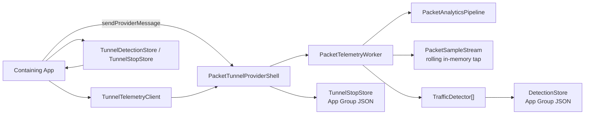

# relative-protocol

`relative-protocol` is a Swift package for packet-tunnel VPN products that need three things at once:

1. a real packet tunnel dataplane
2. a bounded, app-readable live telemetry tap
3. durable, pluggable traffic detectors that run inside the tunnel extension

The package is detector-first, not packet-log-first.
It is designed so the tunnel can stay alive and keep detecting while the containing app is suspended, while the app can still read a recent live window on demand when it is foregrounded.

## Recent Changes

- transport recovery hardening
  - outbound TCP now uses bounded connect attempts with retry for stalled `NWConnection.State.preparing`
  - outbound UDP sessions now restart or rotate on `waiting`, `failed`, write-side failure, and better-path replacement signals
  - outbound TCP better-path handling is now explicit during connect attempts instead of log-only
- relay concurrency cleanup
  - per-connection relay work now runs off dedicated queues instead of funneling all flow callbacks through one shared queue
- explicit network policy surface
  - added `TunnelMTUStrategy` so hosts can choose fixed MTU or automatic `tunnelOverheadBytes`
  - added `TunnelDNSStrategy` for cleartext DNS, DNS-over-TLS, DNS-over-HTTPS, or no DNS override
  - provider-configuration defaults are now explicit package policy instead of hidden hardcoded values
- detector-grade sparse record expansion
  - added `flowSlice` records on a bounded cadence
  - added explicit `flowClose` records
  - enriched burst records with typed onset and burst-shape counters
- richer typed detector surfaces
  - packet shape, control-signal, lifecycle, burst-shape, DNS association, lineage, path-regime, and service-attribution fields are now first-class typed record fields
  - no string-metadata escape hatch is required for these surfaces
- detector-declared requirements
  - detectors now declare required record kinds and feature families through `DetectorRequirements`
  - the worker computes one runtime union plan and only activates requested enrichments
- bounded enrichment subsystems
  - added DNS association caching
  - added flow lineage and reuse tracking
  - added path-regime stamping
  - added generic service-family attribution
  - added a shared detector arming/suppression state helper
- cleaner detector-vs-app split
  - detector-facing sparse records can now be richer than the foreground live tap
  - `flowSlice` remains detector-only by default unless a host opts into exposing it in the live tap
- expanded verification
  - added package tests for flow slices, flow close, burst-shape counters, detector projection, DNS association, lineage, path regime, and live-tap publication of DNS answers/association

## What This Package Does

- runs a packet tunnel using `NEPacketTunnelProvider`
- bridges packets into a local SOCKS relay + dataplane
- emits a bounded in-memory rolling telemetry window
- runs one or more detectors inside the tunnel extension
- persists compact detector outputs and stop breadcrumbs to the App Group container
- exposes foreground snapshots through `NETunnelProviderSession.sendProviderMessage`

## What This Package Does Not Do

- continuously persist raw packet history to disk
- assume the containing app can stay awake forever in the background
- force one product-specific detector vocabulary on all package users

## Current Runtime Model

There are two telemetry surfaces:

1. `live tap`
   - rolling in-memory packet/event window
   - roughly `10s` by default
   - foreground app reads it on demand
   - intentionally leaner than the full detector-facing sparse stream

2. `durable detections`
   - compact detector outputs persisted in the App Group container
   - survive app suspension, process death, and long background gaps

The tunnel extension is the source of truth for detection.
The containing app is a reader, not the runtime brain.

## Package Layout

- `Sources/Analytics`
  - packet summarization, rolling tap, detector protocol, detector store, app-message payloads
- `Sources/TunnelControl`
  - `NEPacketTunnelProvider` shell, profile decoding, tunnel/app messaging, startup/shutdown wiring
- `Sources/PacketRelay`
  - SOCKS5 TCP/UDP relay, tunnel bridge, packet forwarding
- `Sources/TunnelRuntime`
  - dataplane runtime orchestration and deterministic test helpers
- `Sources/DataplaneFFI`
  - Swift/C bridge into the bundled dataplane runtime
- `Sources/HostClient`
  - host-app snapshot client and persisted store readers
- `Sources/Observability`
  - structured logging, JSONL/OSLog sinks, signposts
- `Sources/HarnessLocal`
  - local harness for replay and package-level testing

## Public Integration Surface

Most host apps interact with these types:

- `TunnelProfile`
- `TunnelProfileManager`
- `PacketTunnelProviderShell`
- `TunnelTelemetryClient`
- `TunnelDetectionStore`
- `TunnelStopStore`
- `TrafficDetector`
- `DetectorRequirements`
- `DetectorFeatureFamily`
- `DetectorArmingStateMachine`
- `DetectionEvent`
- `DetectionSnapshot`

## Architecture



## Core Concepts

### Rolling Live Tap

`PacketSampleStream` is an in-memory ring-like rolling window.
It is intentionally ephemeral.
It exists so a foreground app can inspect recent evidence without forcing the tunnel to keep a durable packet log.

### Detector Pipeline

`PacketAnalyticsPipeline` turns raw packets into sparse detector-friendly events:

- `flowOpen`
- `flowSlice`
- `flowClose`
- `metadata`
- `burst`
- `activitySample`

These are not full packet logs.
They are lower-cost runtime signals designed for detectors.

The detector path can be richer than the app-facing live tap.
By default, the tunnel may emit detector-grade `flowSlice` records for in-extension detectors while keeping the foreground live tap leaner.
That means:

- detectors can receive `flowSlice`
- the default app-facing live tap does not surface `flowSlice`
- a host app can therefore legitimately see `0` `flowSlice` rows even while detectors are using them

This is intentional.
`flowSlice` is a high-value detector primitive, but publishing every slice into the foreground live tap would inflate snapshot volume, memory pressure, and UI/debug overhead without improving durable correctness.

### Durable Detections

`DetectionStore` persists compact summaries such as:

- detector identifier
- signal kind
- target bucket
- timestamp
- confidence
- aggregate counts
- recent redacted detector events

This is the durable system of record for background correctness.

## App Group Layout

The package writes small, explicit artifacts under the App Group container:

```text
<AppGroup>/Analytics/
  Detections/
    detections.json
  last-stop.json
<AppGroup>/Logs/
  events.current.jsonl
  events.<timestamp>.<sequence>.jsonl
```

Persisted App Group artifacts are file-protected and excluded from device/iCloud backup.

The package does not persist the rolling live tap.
It does persist bounded JSONL tunnel logs by default.

## Installation

Add the package to your app and tunnel extension targets through Swift Package Manager.

### Package products

- `Analytics`
- `DataplaneFFI`
- `HostClient`
- `Observability`
- `PacketRelay`
- `TunnelControl`
- `TunnelRuntime`

### Typical target wiring

Most apps should link products like this:

- containing app target
  - `HostClient`
  - `TunnelControl`
- packet tunnel extension target
  - `Analytics`
  - `TunnelControl`
  - `PacketRelay`
  - `TunnelRuntime`
  - `Observability`
  - `DataplaneFFI`

The app mainly:

- installs and updates the VPN profile
- starts and stops the tunnel
- reads foreground snapshots
- reads persisted detections and stop records

The extension mainly:

- runs the tunnel
- runs detectors
- persists durable detector outputs
- exposes the live tap through provider messages

## Tunnel Integration

### 1. Define a tunnel provider subclass

Subclass `PacketTunnelProviderShell` inside your Network Extension target.

```swift
import TunnelControl

final class PacketTunnelProvider: PacketTunnelProviderShell {}
```

That is enough for the default runtime.

If you want custom detectors, override `makeDetectors(...)` in this subclass.

### 2. Build and persist a `TunnelProfile`

The containing app supplies provider configuration through `NETunnelProviderProtocol.providerConfiguration`.

Important fields in `TunnelProfile`:

- `appGroupID`
- `tunnelRemoteAddress`
- `mtu`
- `mtuStrategy`
- `ipv6Enabled`
- `tcpMultipathHandoverEnabled`
- `dnsServers`
- `dnsStrategy`
- `engineSocksPort`
- `engineLogLevel`
- `telemetryEnabled`
- `liveTapEnabled`
- `liveTapIncludeFlowSlices`
- `liveTapMaxBytes`
- `signatureFileName`
- `relayEndpoint`
- `dataplaneConfigJSON`

`telemetryEnabled = true` enables:

- the sparse packet analytics pipeline
- in-extension detectors
- durable detection persistence

`liveTapEnabled = true` enables:

- the rolling live tap
- foreground packet/event snapshots

`liveTapIncludeFlowSlices = true` opts the app-facing live tap into detector-grade `flowSlice` records.
Keep this off for normal product reads and enable it only when you intentionally want a richer debug surface.

`liveTapEnabled` only has effect when `telemetryEnabled` is also `true`.
The default live tap stays lean even when detector telemetry is richer.
It does not mean every sparse detector record kind is surfaced to the app.

`tcpMultipathHandoverEnabled = true` opts outbound TCP connects into `NWParameters.MultipathServiceType.handover`.
It is disabled by default so multipath stays an explicit host-app policy choice.

`mtuStrategy` controls whether the package installs a fixed interface MTU or lets NetworkExtension derive the interface MTU from `tunnelOverheadBytes`.
The package default for provider-configuration users is a fixed MTU of `1500`.
Existing direct `TunnelProfile(...)` callers stay backward-compatible: if you pass only `mtu`, the profile uses `.fixed(mtu)`.
When you choose `.automaticTunnelOverhead(...)`, the tunnel interface MTU is no longer fixed explicitly. In that mode, `mtu` remains a local buffer hint for relay/runtime code, while NetworkExtension derives the interface MTU from the active physical path.

`dnsStrategy` controls whether the tunnel installs cleartext DNS, DNS-over-TLS, DNS-over-HTTPS, or no DNS override at all.
The package default for provider-configuration users is `dnsStrategy = .noOverride`.

Existing direct `TunnelProfile(...)` callers stay backward-compatible here too: if you pass only `dnsServers`, the profile uses `.cleartext(servers: dnsServers)`.
If you want to preserve the system resolver path, set `dnsStrategy = .noOverride` explicitly. Do not rely on `dnsServers: []` with a missing `dnsStrategy`, because the direct `TunnelProfile(...)` initializer treats that as cleartext DNS configuration over the provided `dnsServers` array.
When you choose `.tls(...)` or `.https(...)`, provide a real `serverName` or `serverURL` along with resolver IPs so the encrypted DNS policy is fully specified.

Recommended host-app policies:

- generic compatibility default: `mtuStrategy = .fixed(1500)`
- protocol-aware UDP tunnel: `mtuStrategy = .automaticTunnelOverhead(80)` when you know your encapsulation overhead
- full-tunnel DNS with public resolvers: `dnsStrategy = .cleartext(servers: TunnelDNSStrategy.defaultPublicResolvers)`
- compatibility-first fallback: `dnsStrategy = .cleartext(..., allowFailover: true)` on iOS 26+
- preserve system DNS: `dnsStrategy = .noOverride`

Example:

```swift
let profile = TunnelProfile(
    appGroupID: "group.com.example.vpn",
    tunnelRemoteAddress: "127.0.0.1",
    mtu: 1_500,
    mtuStrategy: .fixed(1_500),
    ipv6Enabled: true,
    tcpMultipathHandoverEnabled: false,
    ipv4Address: "10.0.0.2",
    ipv4SubnetMask: "255.255.255.0",
    ipv4Router: "10.0.0.1",
    ipv6Address: "fd00:1::2",
    ipv6PrefixLength: 64,
    dnsServers: [],
    dnsStrategy: .noOverride,
    engineSocksPort: 0,
    engineLogLevel: "info",
    telemetryEnabled: true,
    liveTapEnabled: true,
    liveTapIncludeFlowSlices: true,
    liveTapMaxBytes: 1_048_576,
    signatureFileName: "app_signatures.json",
    relayEndpoint: RelayEndpoint(host: "127.0.0.1", port: 1080, useUDP: false),
    dataplaneConfigJSON: "{}"
)
```

### Migration from earlier releases

Transport recovery improvements do not require host-app changes.
If you upgrade the package, you automatically get:

- bounded TCP connect timeout and retry
- UDP session restart and replacement on bad-path signals
- better-path-aware outbound TCP connect policy

Network policy defaults do change if your extension relies on `TunnelProfile.from(providerConfiguration:)` with missing keys.

Migration rules:

1. If your app constructs `TunnelProfile(...)` directly and already passes `mtu` and `dnsServers`, behavior stays backward-compatible.
2. If your extension decodes sparse `providerConfiguration` and relied on package defaults, be explicit now. The package default policy is `mtuStrategy = .fixed(1500)` and `dnsStrategy = .noOverride`.
3. If you want the old “always install public cleartext DNS” behavior, set it explicitly with `dnsStrategy = .cleartext(servers: TunnelDNSStrategy.defaultPublicResolvers)` instead of depending on defaults.
4. If you know your tunnel encapsulation overhead, prefer `mtuStrategy = .automaticTunnelOverhead(...)` instead of guessing fixed MTU values.
5. Leave `tcpMultipathHandoverEnabled` disabled unless your product has a specific reason to opt into Multipath TCP handover.

Recommended migration profiles:

- compatibility-first
  - `mtuStrategy = .fixed(1500)`
  - `dnsStrategy = .noOverride`
- explicit public-DNS full tunnel
  - `mtuStrategy = .fixed(1500)`
  - `dnsStrategy = .cleartext(servers: TunnelDNSStrategy.defaultPublicResolvers)`
- protocol-aware UDP tunnel
  - `mtuStrategy = .automaticTunnelOverhead(80)`
  - choose `dnsStrategy` explicitly instead of inheriting package defaults

Operational note:

- the package now exposes the DNS/MTU choices as policy, but the right DNS choice is still network-dependent
- in our own device testing, `1500 + explicit public DNS` performed better than `1500 + noOverride` on at least one real handoff scenario
- if your product depends on consistent resolver behavior, encode that policy explicitly in the host app instead of treating defaults as contract

Current default split:

- detector path
  - can see `flowOpen`, `flowSlice`, `flowClose`, `metadata`, `burst`, `activitySample`
- default app-facing live tap
  - surfaces `flowOpen`, `metadata`, `burst`, `flowClose`
  - keeps `flowSlice` detector-only by default
  - buffers `activitySample` and only surfaces it when a nearby `metadata`, `burst`, or `flowClose` event makes that context useful

### 3. Configure `NETunnelProviderManager` in the containing app

The package does not install the VPN profile for you automatically.
Your app still owns:

- creating a `NETunnelProviderManager`
- assigning a `NETunnelProviderProtocol`
- writing `TunnelProfile` into `providerConfiguration`
- saving/loading preferences
- starting and stopping the connection

`TunnelProfileManager.configure(...)` exists to keep that profile encoding consistent.

### 4. Start the tunnel normally

Use `NETunnelProviderManager` / `NEVPNManager` from the containing app.
`PacketTunnelProviderShell` handles:

- network settings install
- SOCKS relay startup
- dataplane startup
- packet read/write loops
- app-message handling

## Foreground App Reads

Use `TunnelTelemetryClient` while the app is active.

```swift
import HostClient
import NetworkExtension

let client = TunnelTelemetryClient()
let snapshot = try await client.snapshot(from: manager.connection, packetLimit: 48)

print(snapshot.samples.count)
print(snapshot.detections.totalDetectionCount)
```

Available operations:

- `snapshot(from:packetLimit:)`
- `clearRecentEvents(from:)`
- `clearDetections(from:)`

This uses Apple’s tunnel-provider messaging path rather than a shared file tail.

## Background Recovery

When the app is resumed after a long background period, read persisted detector outputs instead of depending on the live tap.

```swift
import HostClient

let store = TunnelDetectionStore(appGroupID: "group.com.example.vpn")
let detections = try store.load() ?? .empty
let lastStop = try TunnelStopStore(appGroupID: "group.com.example.vpn").load()
```

Use the live tap for recent context.
Use the persisted store for durable correctness.

## Adding Custom Detectors

The package exposes `TrafficDetector` so downstream users can add their own runtime logic.

```swift
import Analytics

final class AdBurstDetector: TrafficDetector {
    let identifier = "ad-burst"
    let requirements = DetectorRequirements(
        recordKinds: [.flowOpen, .burst, .flowClose],
        featureFamilies: [.packetShape, .controlSignals, .hostHints]
    )

    func ingest(_ records: DetectorRecordCollection) -> [DetectionEvent] {
        // Inspect sparse records and emit durable detections when your conditions match.
        return []
    }

    func reset() {}
}
```

### Detector implementation options

`TrafficDetector` is intentionally generic.
The package does not force one detector style.

Common patterns:

1. heuristic detector
   - plain Swift logic over `DetectorRecord`
   - best default choice
   - easiest to test and reason about

2. rules-engine detector
   - same as a heuristic detector, but with externally supplied thresholds or signatures
   - useful when non-code tuning matters

3. tiny ML detector
   - small in-process model fed by sparse feature vectors
   - good for scoring sequences or confidence
   - should run on detector features, not raw packets

4. native scorer detector
   - Swift detector calls into C, C++, Rust, or another embedded native library
   - useful when you already have an optimized scoring engine

The package contract is the same in all four cases:

- declare `DetectorRequirements`
- ingest sparse `DetectorRecord` batches
- keep bounded in-memory state
- emit `DetectionEvent`
- persist only compact outputs

### Detector requirements

Every detector can declare the exact record kinds and feature families it needs.
The package keeps this inside the normal iOS packet-tunnel model:

- packet ingress still comes from `NEPacketTunnelProvider`
- path-regime updates come from `NWPathMonitor`

Use `DetectorRequirements` to request:

- record kinds
  - `flowOpen`
  - `flowSlice`
  - `flowClose`
  - `metadata`
  - `burst`
  - `activitySample`
- feature families
  - `packetShape`
  - `controlSignals`
  - `burstShape`
  - `hostHints`
  - `quicIdentity`
  - `stringAddresses`
  - `dnsAnswerAddresses`
  - `dnsAssociation`
  - `lineage`
  - `pathRegime`
  - `serviceAttribution`
- preferred cadence
  - `preferredFlowSliceIntervalMs`
  - only applies when the detector requests `flowSlice`
  - bounded to `200...1000 ms`

The worker computes the union once across installed detectors.
That means:

- expensive enrichment is only activated when some detector asks for it
- each detector receives a projected lazy view, not the full raw batch
- the app-facing live tap still stays lean by default

If a detector does not declare requirements explicitly, the package uses a compatibility default that matches the pre-requirements detector surface.

### What belongs inside a detector

Good detector responsibilities:

- feature extraction from sparse records
- short rolling state keyed by flow, host, or target bucket
- sequence scoring
- confidence assignment
- emitting compact `DetectionEvent` values

Bad detector responsibilities:

- raw packet capture
- blocking file I/O
- network requests
- cross-process RPC
- unbounded caches
- large per-packet model inference

### Using a tiny ML model

If you want ML-backed detection, the recommended shape is:

1. use `PacketAnalyticsPipeline` output as features, not raw packets
2. build a compact feature vector inside your detector
3. load the model once
4. score synchronously and cheaply
5. emit a normal `DetectionEvent`

This usually means:

- `CoreML` model loaded in the tunnel extension target
- or a tiny custom scorer linked into the extension

Keep the bar high:

- small model
- low latency
- no dynamic downloads
- no per-record heavy allocation

### Using a native binary or embedded scorer

If you already have a small native detector/scorer:

- link it into the tunnel extension target
- wrap it behind a Swift `TrafficDetector`
- pass only compact features across the boundary

Do not design this as an external process.
The detector must run in-process inside the extension.

### Detector design checklist

Before shipping a custom detector, make sure it:

1. processes `DetectorRecordCollection` in linear time
2. keeps bounded memory
3. does not block the telemetry worker
4. degrades gracefully when some records are skipped or shed
5. uses stable `signal`, `target`, and `trigger` strings
6. persists only the detector output, not raw evidence
7. can recover correctly after long app background gaps

### Register detectors

Override `PacketTunnelProviderShell.makeDetectors(profile:analyticsRootURL:logger:)` in your provider subclass.

```swift
import Analytics
import Observability
import TunnelControl

final class PacketTunnelProvider: PacketTunnelProviderShell {
    override func makeDetectors(
        profile: TunnelProfile,
        analyticsRootURL: URL,
        logger: StructuredLogger
    ) async throws -> [any TrafficDetector] {
        _ = profile
        _ = analyticsRootURL
        _ = logger

        return [
            AdBurstDetector()
        ]
    }
}
```

This is the main extension point for detector customization.

### Integrating detectors in a different app

For a host app, the typical setup is:

1. add the package to both your app target and packet tunnel extension target
2. create your own `PacketTunnelProvider: PacketTunnelProviderShell`
3. override `makeDetectors(...)`
4. return your custom detector list
5. use `TunnelTelemetryClient` in the app for foreground snapshots
6. use `TunnelDetectionStore` and `TunnelStopStore` for background recovery

That is the supported package integration path.
You do not need to patch package internals to add detectors.

## Detector Surfaces

There are several detector-related surfaces in the package.
They are not interchangeable.

Use them like this:

### 1. Detector registration surface

This is where detectors are installed into the tunnel runtime:

- `PacketTunnelProviderShell.makeDetectors(profile:analyticsRootURL:logger:)`

Use this when you want to:

- add one or more custom detectors
- load detector-local resources from the App Group analytics root
- choose detectors based on product config

This is an extension-runtime hook, not an app-facing read path.

### 2. Detector runtime input surface

This is what detectors actually consume:

- `TrafficDetector`
- `DetectorRequirements`
- `DetectorFeatureFamily`
- `DetectorRecordCollection`
- `DetectorRecord`

Use this when you want to:

- inspect sparse traffic features
- build rolling detector state
- score rules or ML features
- emit durable `DetectionEvent` values

This is the main detector-facing API surface.

### 3. Sparse record-kind surface

These are the record kinds the pipeline can emit for detectors:

- `flowOpen`
- `flowSlice`
- `flowClose`
- `metadata`
- `burst`
- `activitySample`

Use them like this:

- `flowOpen`
  - first lifecycle marker for a tracked flow
- `flowSlice`
  - fixed-cadence aggregate for short-window features
  - best source for throughput, concentration, packet-shape, and control-mix features
- `flowClose`
  - lifecycle end marker with typed close reason
- `metadata`
  - host/DNS/TLS/QUIC enrichment boundary
  - also where DNS association caches are refreshed when enabled
- `burst`
  - completed burst with onset and burst-shape counters
- `activitySample`
  - coarse low-frequency activity rollup

If you are building detectors, this is usually the most important surface to reason about.

### 4. Typed feature surface

These detector-facing typed fields are available on `DetectorRecord`:

- flow/lifecycle
  - `kind`
  - `timestamp`
  - `direction`
  - `flowHash`
  - `flowPacketCount`
  - `flowByteCount`
  - `closeReason`
- volume and packet shape
  - `bytes`
  - `packetCount`
  - `largePacketCount`
  - `smallPacketCount`
- protocol/control mix
  - `protocolHint`
  - `ipVersion`
  - `transportProtocolNumber`
  - `udpPacketCount`
  - `tcpPacketCount`
  - `quicInitialCount`
  - `tcpSynCount`
  - `tcpFinCount`
  - `tcpRstCount`
- endpoint and host enrichment
  - `sourcePort`
  - `destinationPort`
  - `registrableDomain`
  - `dnsQueryName`
  - `dnsCname`
  - `dnsAnswerAddresses`
  - `tlsServerName`
  - `classification`
- DNS association
  - `associatedDomain`
  - `associationSource`
  - `associationAgeMs`
  - `associationConfidence`
- QUIC enrichment
  - `quicVersion`
  - `quicPacketType`
  - `quicDestinationConnectionId`
  - `quicSourceConnectionId`
- flow lineage
  - `lineageID`
  - `lineageGeneration`
  - `lineageAgeMs`
  - `lineageReuseGapMs`
  - `lineageReopenCount`
  - `lineageSiblingCount`
- path regime
  - `pathEpoch`
  - `pathInterfaceClass`
  - `pathIsExpensive`
  - `pathIsConstrained`
  - `pathSupportsDNS`
  - `pathChangedRecently`
- service attribution
  - `serviceFamily`
  - `serviceFamilyConfidence`
  - `serviceAttributionSourceMask`
- burst-shape fields
  - `burstDurationMs`
  - `burstPacketCount`
  - `leadingBytes200ms`
  - `leadingPackets200ms`
  - `leadingBytes600ms`
  - `leadingPackets600ms`
  - `burstLargePacketCount`
  - `burstUdpPacketCount`
  - `burstTcpPacketCount`
  - `burstQuicInitialCount`

These are the typed detector surfaces you should prefer over string metadata.

### 5. Durable detector output surface

This is what detectors emit and what the package persists:

- `DetectionEvent`
- `DetectionSnapshot`
- `DetectionStore`
- `TunnelDetectionStore`

Use this when you want to:

- build product state
- recover after app suspension
- show detector results in the app
- persist compact detector outputs safely

This is the detector system of record for app-visible product behavior.

### 6. Foreground debug/read surface

This is what the app can ask the tunnel for while it is active:

- `TunnelTelemetryClient`
- `TunnelTelemetrySnapshot`
- `PacketSample`

Use this when you want to:

- inspect recent foreground tunnel activity
- debug detector timing
- correlate a just-fired detection with nearby sparse records

Important:

- this is a debug/read surface
- it is intentionally leaner than the full detector-facing sparse stream
- it is not the source of truth for background correctness

### 7. Optional low-cost classification surface

The package can enrich sparse records with a classifier label from signatures:

- `SignatureClassifier`
- `<AppGroup>/Analytics/AppSignatures/<signatureFileName>`

Use this when you want to:

- add cheap app/domain classification hints
- gate detectors on a coarse label
- reduce host-token heuristics in your detector code

This is an input hint, not an authoritative detector output.

### 8. Shared detector state helpers

The package also exposes one generic state helper:

- `DetectorArmingStateMachine`

Use it when you want a lightweight shared implementation for:

- cold-start settling
- post-count cooldown
- temporary suppression after path/regime changes

It is optional.
Product-specific event semantics still belong in your detector.

### 9. Detector control/config surface

These `TunnelProfile` knobs control whether the detector pipeline and app-facing reads exist:

- `telemetryEnabled`
- `liveTapEnabled`
- `liveTapIncludeFlowSlices`
- `liveTapMaxBytes`

Use them like this:

- `telemetryEnabled`
  - turns on sparse analytics, detector execution, and durable detector persistence
- `liveTapEnabled`
  - turns on the app-facing rolling live tap
  - does not imply every detector-grade record kind is exposed to the app
- `liveTapIncludeFlowSlices`
  - opts the app-facing live tap into publishing detector-grade `flowSlice` records
  - intended for richer inspection/debug scenarios, not default product reads
- `liveTapMaxBytes`
  - bounds the in-memory live tap footprint

### 10. What is not a detector surface

Do not treat these as your primary detector integration surface:

- raw packet persistence
- the containing app polling loop
- UI-only state
- string metadata for core typed traffic features

The intended detector model is:

- tunnel extension owns detection
- detectors read sparse typed records
- detectors emit compact `DetectionEvent` values
- the app reads durable outputs and optional recent debug context

## Detector Contract

`TrafficDetector` implementations receive `DetectorRecord` batches.
They should also declare `requirements` so the telemetry worker can avoid computing unused enrichment.
Those records contain stable fields such as:

- `kind`
- `timestamp`
- `direction`
- `bytes`
- `packetCount`
- `flowPacketCount`
- `flowByteCount`
- `protocolHint`
- `sourcePort`
- `destinationPort`
- `flowHash`
- `registrableDomain`
- `dnsQueryName`
- `dnsCname`
- `dnsAnswerAddresses`
- `ipVersion`
- `transportProtocolNumber`
- `tlsServerName`
- `quicVersion`
- `quicPacketType`
- `quicDestinationConnectionId`
- `quicSourceConnectionId`
- `classification`
- `associatedDomain`
- `associationSource`
- `associationAgeMs`
- `associationConfidence`
- `closeReason`
- `largePacketCount`
- `smallPacketCount`
- `udpPacketCount`
- `tcpPacketCount`
- `quicInitialCount`
- `tcpSynCount`
- `tcpFinCount`
- `tcpRstCount`
- `burstDurationMs`
- `burstPacketCount`
- `leadingBytes200ms`
- `leadingPackets200ms`
- `leadingBytes600ms`
- `leadingPackets600ms`
- `burstLargePacketCount`
- `burstUdpPacketCount`
- `burstTcpPacketCount`
- `burstQuicInitialCount`
- `lineageID`
- `lineageGeneration`
- `lineageAgeMs`
- `lineageReuseGapMs`
- `lineageReopenCount`
- `lineageSiblingCount`
- `pathEpoch`
- `pathInterfaceClass`
- `pathIsExpensive`
- `pathIsConstrained`
- `pathSupportsDNS`
- `pathChangedRecently`
- `serviceFamily`
- `serviceFamilyConfidence`
- `serviceAttributionSourceMask`

Requirements guidance:

- only request the record kinds your detector actually uses
- only request feature families your detector will read
- prefer `flowOpen` / `metadata` / `burst` / `flowClose` over `flowSlice` unless you need short-window cadence features
- request `stringAddresses` and `dnsAnswerAddresses` only when you truly need them
- treat `lineage`, `dnsAssociation`, `pathRegime`, and `serviceAttribution` as optional higher-cost signal

Record-kind guidance:

- `flowOpen`
  - first admitted sparse record for a tracked flow
  - good for detector-side flow lifecycle start markers
- `flowSlice`
  - fixed-cadence per-flow aggregate, `250 ms` by default
  - good for short-window throughput, packet mix, control-signal, and concentration features
  - detector-grade by default and not normally shown in the foreground live tap
- `flowClose`
  - explicit or synthetic lifecycle end marker
  - `closeReason` is one of:
    - `tcpFin`
    - `tcpRst`
    - `idleEviction`
    - `overflowEviction`
- `metadata`
  - sparse host/DNS/TLS/QUIC enrichment boundary
- `burst`
  - completed burst boundary with onset and protocol-shape counters
- `activitySample`
  - coarse low-frequency activity rollup kept mainly for recent foreground context
  - not every emitted activity sample is guaranteed to appear in the live tap snapshot

Typed counter guidance:

- `largePacketCount` / `smallPacketCount`
  - packet-size bucket counts for the current record window
- `udpPacketCount` / `tcpPacketCount`
  - protocol mix for the current record window
- `quicInitialCount`
  - number of QUIC Initial candidates in the current record window
- `tcpSynCount` / `tcpFinCount` / `tcpRstCount`
  - cheap TCP control-signal counts surfaced directly from the fast parser
- `leadingBytes200ms` / `leadingPackets200ms`
  - first `200 ms` onset shape for a completed burst
- `leadingBytes600ms` / `leadingPackets600ms`
  - first `600 ms` onset shape for a completed burst
- `burstLargePacketCount` / `burstUdpPacketCount` / `burstTcpPacketCount` / `burstQuicInitialCount`
  - burst-local packet-shape counters emitted alongside `burst`

`DetectorRecordCollection` is a lightweight batch wrapper.
Use it when you want to:

- iterate the batch once
- short-circuit on the first strong match
- avoid materializing extra arrays inside your detector
- receive only the projected record kinds and typed fields your detector requested

Hot-path rule:

- `ingest(_:)` runs inline on the single telemetry worker
- do not do blocking I/O
- do not sleep or wait on cross-process work
- do not allocate unbounded state from packet input
- keep per-batch work linear and cheap

Detectors emit `DetectionEvent` values.
Those are what the package persists and surfaces to the app.

String-field contract:

- `detectorIdentifier` is the primary namespace
- `signal` is a stable detector-defined event identifier
- `target` is an optional stable detector-defined subject bucket
- `trigger` is a stable detector-defined cause label
- downstream code should treat unknown values as forward-compatible and scope parsing by `detectorIdentifier`

Recommended naming pattern:

- `detectorIdentifier`
  - stable namespace for one detector implementation
  - example: `ad-burst`
- `signal`
  - stable event kind within that detector
  - example: `video-transition`
- `target`
  - stable subject bucket if you need one
  - example: `pre-roll-ad`
- `trigger`
  - stable cause or evidence label
  - example: `burst`

That gives downstream code a forward-compatible parsing model.

## Detector Persistence Model

`DetectionSnapshot` is the durable aggregate returned to the app.
It includes:

- `updatedAt`
- `totalDetectionCount`
- `countsByDetector`
- `countsByTarget`
- `recentEvents`

This is intentionally generic.
If you need richer detector-specific state, you can either:

- expose it in live foreground reads through `DetectionEvent.metadata`
- or maintain your own auxiliary store in the App Group container for durable state

Recommended persistence split:

- live tap
  - short-lived evidence/debug context
  - intentionally leaner than the full detector-facing sparse stream
  - should be treated as a debug surface, not the detector system of record
- `DetectionSnapshot`
  - durable product state
- your own auxiliary detector store
  - only if your product truly needs detector-specific durable state

## Signatures

`SignatureClassifier` can optionally load a signature file from:

```text
<AppGroup>/Analytics/AppSignatures/<signatureFileName>
```

Current JSON shape:

```json
{
  "version": 1,
  "updatedAt": "2026-03-04T00:00:00Z",
  "signatures": [
    {
      "label": "social-video",
      "domains": ["video-cdn.example", "media-edge.example"]
    }
  ]
}
```

The analytics pipeline uses signatures as low-cost classification input.

## Operational Defaults

Current package defaults:

- live tap retention window: `10s`
- foreground packet snapshot cap: `96`
- telemetry queue cap: `2` batches / `256 KB`
- detector `flowSlice` cadence: `250 ms`
- default live tap publishes `flowOpen`, `metadata`, `burst`, and `flowClose`
- default live tap does not publish `flowSlice`
- default `liveTapIncludeFlowSlices`: `false`
- health sample interval: `60s`
- more aggressive telemetry backoff at elevated thermal states

These defaults bias toward tunnel stability and battery efficiency over exhaustive logging.

## Thermal Model

The worker reads:

- `ProcessInfo.thermalState`
- `ProcessInfo.isLowPowerModeEnabled`

Policy shape:

- `nominal`
  - detector-side `flowSlice` enabled
  - sparse activity samples enabled
  - limited deep metadata allowed
- `fair`
  - detector-side `flowSlice` still enabled
  - deep metadata off
  - activity samples off
- `serious` / `critical` / low power mode
  - detector-side `flowSlice` off
  - deep metadata off
  - activity samples off

This is intentional.
The package is designed to degrade telemetry cost before the tunnel becomes thermally unsafe.

## Debugging

### Structured logs

The package logs through `StructuredLogger` and the `Observability` module.
By default, high-value lifecycle and fault events are retained while hot-path noise stays reduced.

Important files:

- `Sources/Observability/StructuredLogger.swift`
- `Sources/Observability/JSONLLogSink.swift`
- `Sources/Observability/OSLogSink.swift`
- `Sources/Observability/LogEnvelope.swift`

### Last stop reason

The provider persists a small stop breadcrumb to:

```text
<AppGroup>/Analytics/last-stop.json
```

Read it through `TunnelStopStore` when debugging unexpected exits.

### Detector debugging

For detector debugging, inspect both:

1. live tap snapshots from `TunnelTelemetryClient`
2. persisted detection summaries from `TunnelDetectionStore`

That split matters:

- live tap explains the last few seconds
- persisted detections explain long background spans

Useful detector debugging questions:

1. did the tunnel see the expected sparse records?
2. did the detector emit at the right boundary?
3. did confidence match the evidence strength?
4. did the detection persist across app suspension?
5. did shed mode materially affect the detector?

If a foreground app snapshot shows `0` `flowSlice` rows, that is expected with the default package policy.
`flowSlice` is currently detector-facing by default, not app-facing.

If you are debugging model-backed detectors, also record:

- model load success
- model version
- feature-vector shape
- scoring latency bucket

## Profiling Guidance

Use Instruments in separate passes.
Do not stack heavy templates for long runs unless you are chasing a very specific issue.

Recommended order:

1. `Energy Log`
2. `VM Tracker`
3. `Time Profiler` only if a thermal or CPU issue remains

### Why

- `Energy Log` is the cleanest battery/thermal truth
- `VM Tracker` is the cleanest memory truth
- `Time Profiler` is best for root-causing hotspots after one of the above shows a problem

## Stability Checklist

Before calling a build production-ready, validate:

1. `30–60 min` soak with no unexpected tunnel exits
2. Wi‑Fi / `5G` / `LTE` / degraded-network switching
3. background correctness with the containing app suspended
4. persisted detector outputs remain correct after resume
5. no steady memory climb in `VM Tracker`
6. normal usage stays `Nominal` in `Energy Log`

## Background Correctness Rules

A foreground app cannot be the source of truth for traffic detection.
The extension must own runtime detection.

The recommended split is:

- extension
  - live packet/event tap
  - detector execution
  - durable detector persistence
- app
  - foreground snapshot reads
  - persisted detector/stop recovery on resume
  - UI and product logic built on detector outputs

## Production Rollout Guidance

For rollout, track at minimum:

- tunnel start success rate
- unexpected stop rate
- last-stop reason distribution
- detection persistence correctness on resume
- network transition recovery
- thermal state during real usage
- telemetry accepted / skipped / shed rates

Do not use raw packet persistence as your operational metric source.
Use detector outputs and lifecycle signals.

## Security And Data Minimization

The package is intentionally shaped to minimize data retention:

- rolling live tap is memory-only
- detector outputs are compact and explicit
- persisted detector snapshots are privacy-redacted, file-protected, and excluded from backup
- no continuous raw packet log is written by default

If you add custom detectors, keep that same discipline.
Only persist what the product truly needs.

## Apple API References

The package relies on these Apple APIs and behaviors:

- [NEPacketTunnelProvider](https://developer.apple.com/documentation/networkextension/nepackettunnelprovider)
- [NETunnelProvider](https://developer.apple.com/documentation/networkextension/netunnelprovider)
- [NETunnelProviderSession.sendProviderMessage(_:responseHandler:)](https://developer.apple.com/documentation/networkextension/netunnelprovidersession/sendprovidermessage(_:responsehandler:))
- [NETunnelProvider.handleAppMessage(_:completionHandler:)](https://developer.apple.com/documentation/networkextension/netunnelprovider/handleappmessage(_:completionhandler:))
- [FileManager.containerURL(forSecurityApplicationGroupIdentifier:)](https://developer.apple.com/documentation/foundation/filemanager/containerurl(forsecurityapplicationgroupidentifier:))
- [ProcessInfo.thermalState](https://developer.apple.com/documentation/foundation/processinfo/thermalstate)
- [ProcessInfo.isLowPowerModeEnabled](https://developer.apple.com/documentation/foundation/processinfo/islowpowermodeenabled)
- [Data.write(to:options:)](https://developer.apple.com/documentation/foundation/data/write(to:options:))

## License / Usage Notes

This package is infrastructure.
Its compliance story depends on how you use it.
If your product infers cross-app behavior, your privacy disclosures and App Review notes need to describe that clearly and accurately.
